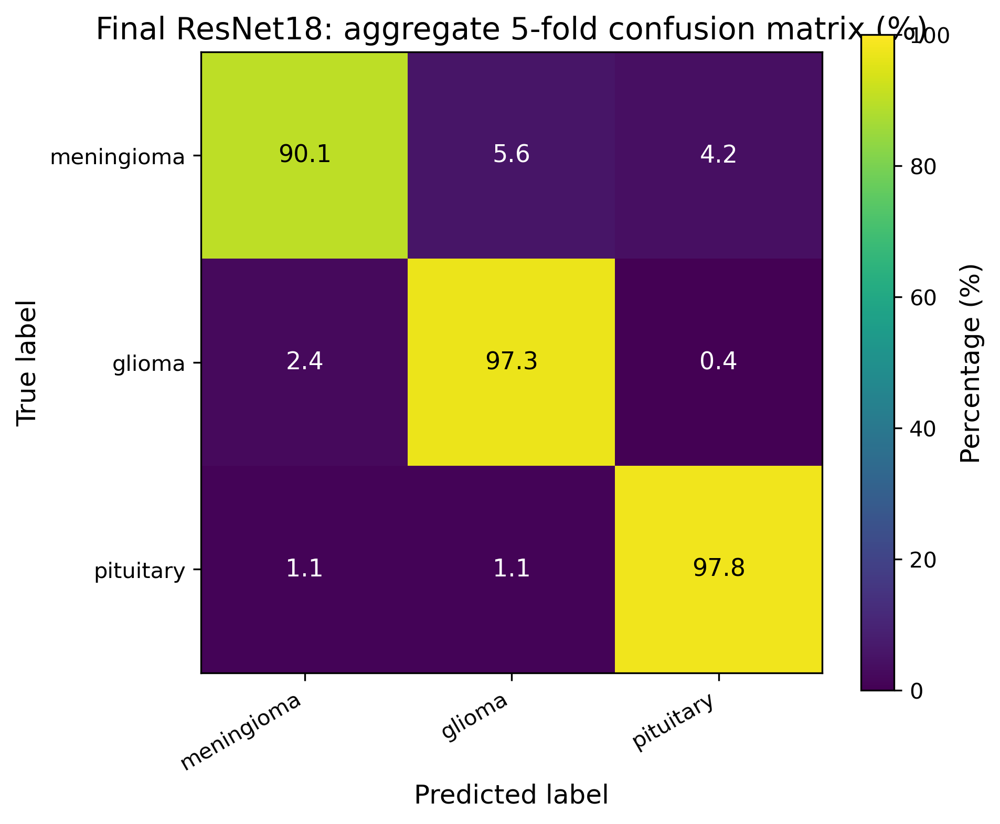

# Brain Tumour MRI Classification with CNNs and Transfer Learning

> Multi-class classification of brain MRI scans (meningioma, glioma, pituitary) comparing custom CNNs against ImageNet-pretrained ResNet18 and EfficientNetB0.

## Overview

A complete deep-learning pipeline built on the public Brain Tumor MRI dataset (3,064 scans across three tumour types, distributed as MATLAB `.mat` files inside four zipped archives). The script handles everything end-to-end: extraction, fold-based cross-validation, class-imbalance treatment, training, and per-model performance comparison.

## Key Features

- **Four model architectures benchmarked side by side** — a small custom CNN, a deeper custom CNN, and two transfer-learning baselines (ResNet18, EfficientNetB0)
- **Five-fold cross-validation** following the dataset's provided `cvind.mat` splits
- **Class-imbalance handling** — optional class weighting and weighted random sampling
- **Training-loop best practices** — early stopping, learning-rate scheduling, model checkpointing
- **Reproducibility** — fixed seeds and deterministic data loading
- **Per-fold and aggregated metrics** — accuracy, precision/recall/F1, confusion matrices

## Tech Stack

`Python` · `PyTorch` · `torchvision` · `NumPy` · `h5py` · `scipy.io` · `Pillow` · `scikit-learn` · `Matplotlib`

## Approach

The dataset ships as four zipped archives of MATLAB v7.3 files, each containing the image, segmentation mask, tumour label, and patient ID. The pipeline first extracts the archives (skipping if already extracted) and loads each scan via `h5py`, since v7.3 `.mat` files are HDF5 under the hood.

Cross-validation uses the dataset's provided fold indices rather than a random split, so results are directly comparable to the published baseline. Each fold trains all four models with identical hyperparameters, so any difference in performance is attributable to model architecture rather than training-loop differences.

The two custom CNNs serve as baselines to contextualise the transfer-learning gains. ResNet18 and EfficientNetB0 are loaded with ImageNet weights, their final classification layers replaced with three-class heads, and fine-tuned end to end.

## Results



Output figures, per-fold metrics, and saved checkpoints are written to `brain_tumour_outputs_current_test/` in the project root.

## How to Run

```bash
git clone https://github.com/<your-username>/brain-tumour-classification.git
cd brain-tumour-classification
pip install -r requirements.txt
```

### Getting the dataset

The full dataset is ~2.5 GB and is **not included in this repository** (it exceeds GitHub's file-size limits and is freely available from the original source).

Download it from Kaggle: <https://www.kaggle.com/datasets/denizkavi1/brain-tumor>

Place the four `brainTumorDataPublic_*.zip` archives and `cvind.mat` into a `dataset/` folder alongside the script:

```
brain-tumour-classification/
├── brain_tumour_classification.py
├── requirements.txt
└── dataset/
    ├── brainTumorDataPublic_1-766.zip
    ├── brainTumorDataPublic_767-1532.zip
    ├── brainTumorDataPublic_1533-2298.zip
    ├── brainTumorDataPublic_2299-3064.zip
    └── cvind.mat
```

The script will unzip the archives automatically on first run.

### Smoke test

For a quick check that the pipeline works end-to-end, edit the config block at the top of the script:

```python
FOLDS_TO_RUN = [1]
MODEL_NAMES  = ["SimpleCNN"]
NUM_EPOCHS   = 3
```

Then:

```bash
python brain_tumour_classification.py
```

## AI-Assistance Disclosure

ChatGPT was used to assist with specific portions of this project — namely parts of the MATLAB/HDF5 loading utilities, the weighted-sampling setup, parts of the training loop (scheduler, checkpoint, early stopping), and general code cleanup. Model choice, preprocessing decisions, experiment design, and interpretation of results are my own.
